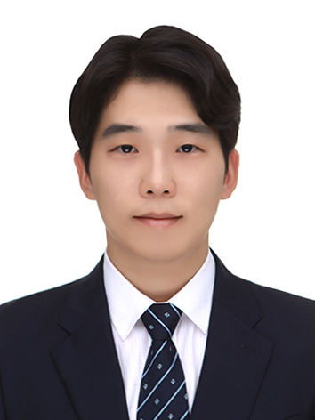

## About Me

Hi! I am a junior year student of B.E. Computer Science at Birla Institute of Technology and Science, Pilani.

This is a jekyll based resume template. You can find the full source code on [GitHub](https://github.com/wheee88)

## Research Interest

Lorem ipsum dolor sit amet, consectetur adipiscing elit. Aliquam finibus ipsum ac erat aliquam dapibus. Vestibulum vehicula placerat ex, a consectetur odio pharetra quis. Mauris id urna ante. Fusce pharetra diam ac nisi aliquet, vel egestas ex iaculis. Pellentesque laoreet cursus tellus sed pellentesque. Praesent a rhoncus elit. Nunc ipsum nisl, consequat sit amet pretium quis, gravida id ipsum.

## Publications
2023
---
1. J. Kim, H. Cho, H. Lee, and H. Jung, “A Study on the Virtual Operation of Energy Storage Devices using the Electric Railway System HILS Platform,” Oct. 2023.  

2022
---
2. H. Noh, H. Cho, S. Choi, and B. Lee, “Mitigating Subsynchronous Torsional Interaction Using Geometric Feature Extraction Method,” Dec. 2022.  

3. J. Kim, J. Ryu, H. Cho, and H. Lee, “A Study on Optimal Operation Strategy of Hydrogen Charging Facilities at Hydrogen Fuel Cell Train Depots,” Oct. 2022.  

4. J. Kim, H. Cho, H. Jung, and H. Kim, “Reliability Demonstration of Auxiliary Power Unit in Railway Vehicles using the Virtual Operation Simulator,” Oct. 2022.  

5. H. Cho, J. Kim, H. Jung, and H. Kim, “Simultaneous DC Railway Power System Analysis Method Using Model-Based TPS,” Jul. 2022.  

2021
---
6. J. Kim, H. Cho, J. Ryu, and H. Kim, “Development and Applicability Test of Fast Charge/Discharge System for DC 1500V Railway Vehicles,” Oct. 2021.  

7. H. Cho, N. Choi, S. Lee, and B. Lee, “Extended Geometric Feature Extraction Process for Detecting Multiple Frequency Oscillations in KEPCO System,” Jun. 2021.  

2020
---
8. H. Noh, H. Cho, S. Lee, and B. Lee, “STATCOM with SSR Damping Controller Using Geometric Extraction on Phase Space Reconstruction Method,” Sep. 2020.  

9. J. Jung, H. Cho, B. Park, and B. Lee, “Enhancement of Linearity and Constancy of PMU Based Voltage Stability Index: Application to a Korean Wide-Area Monitoring System,” Jul. 2020.  

10. D. Kim, H. Cho, B. Park, and B. Lee, “Evaluating Influence of Inverter-based Resources on System Strength Considering Inverter Interaction Level,” Apr. 2020.  

11. H. Cho, N. Choi, and B. Lee, “Oscillation Recognition Using a Geometric Feature Extraction Process Based on Periodic Time-Series Approximation,” Feb. 2020.  

2019
---
12. H. Noh, H. Cho, B. Lee, and S. Lee, “Toward Mitigating Power System Oscillation: STATCOM Controller With Delay Reconstruction Algorithm,” Oct. 2019.  

13. N. Choi, H. Cho, and B. Lee, “Development of Floquet Multiplier Estimator to Determine Nonlinear Oscillatory Behavior in Power System Data Measurement,” May 2019.  

14. N. Choi, B. Park, H. Cho, and B. Lee, “Impact of Momentary Cessation Voltage Level in Inverter-Based Resources on Increasing the Short Circuit Current,” Feb. 2019.  

2018 or earlier
---
15. S. Oh, H. Shin, H. Cho, and B. Lee, “Transient Impact Analysis of High Renewable Energy Sources Penetration According to the Future Korean Power Grid Scenario,” Nov. 2018.  

16. H. Cho, S. Oh, S. Nam and B. Lee, “Nonlinear Dynamics Based Sub-synchronous Resonance Index by Using Power System Measurement Data,” Aug. 2018.  

17. J. Jeong, M. Bae, H. Cho, et al., “Empirical Approach to Regulate Bus Voltage Range in Power Systems,” Jan. 2015.  
