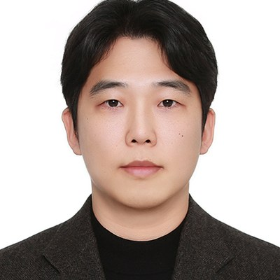

## About Me

I am a senior researcher in the Electric Railway Power Research Division at the Korea Railroad Research Institute (KRRI). My research focuses on power system stability and oscillation analysis, and on electric railway power supply systems including energy-saving operation, hybrid energy storage, and MVDC.

## Education

- B.S. in Electrical and Electronic Engineering, Dankook University, Yongin, South Korea (2007 – 2014)
- Integrated M.S. and Ph.D. in Electrical and Electronic Engineering, Korea University, Seoul, South Korea (2014 – 2020)

## Experience

- Senior Researcher, Electric Railway Power Research Division, Korea Railroad Research Institute (KRRI), Uiwang-si, South Korea (since 2020)

## Research Interests

* **Power Systems** : Power System Oscillations, PMU, Power System Stability etc.
* **Electric Railway Systems** : Energy Saving, Hybrid ESS, MVDC, AC/DC Hybrid, Railway Computation etc.

## Skills

* **Engineering Tools** : PSSE, PSCAD, MATLAB, Simulink, and OPAL-RT (eFPGASim, eMEGASim)
* **Languages** : C and Python

## Publications

First-author papers are highlighted. The full record is also available on [ORCID](https://orcid.org/0000-0002-4966-0099).



### {{ pub.year }}

{{ pub.authors }}, "{{ pub.title }}," *{{ pub.venue }}*, {{ pub.date_label }}.* **{{ pub_text }}**{{ pub_text }} [[DOI]({{ pub.url }})]

